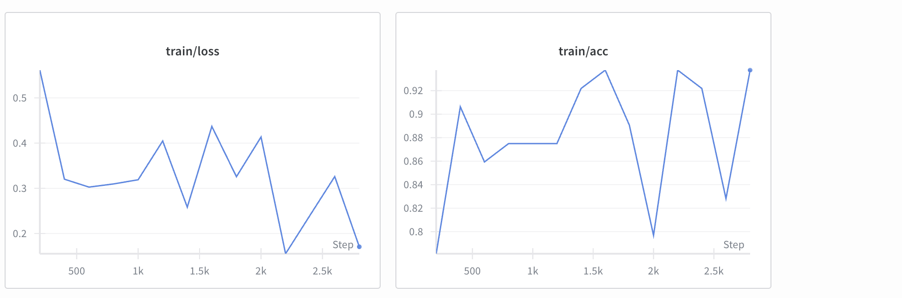
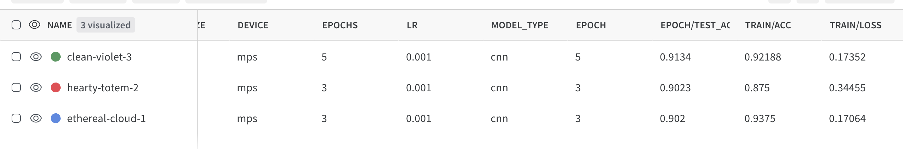
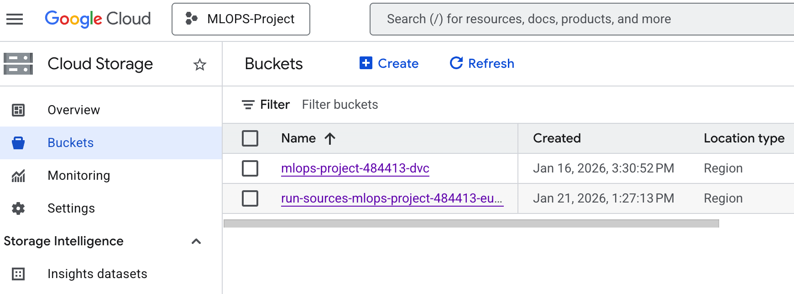
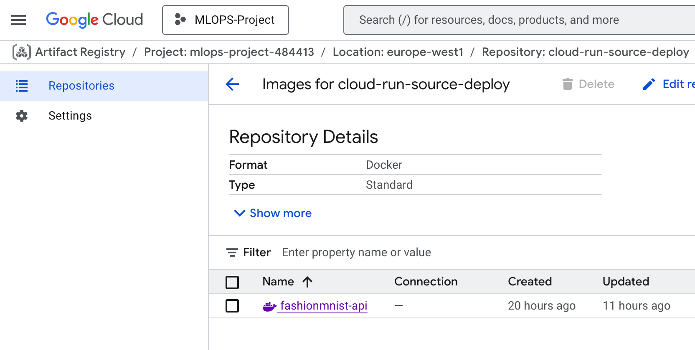
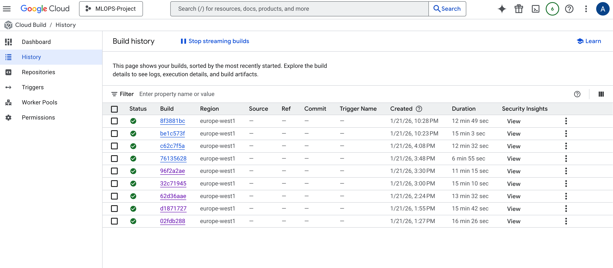

# Exam template for 02476 Machine Learning Operations

This is the report template for the exam. Please only remove the text formatted as with three dashes in front and behind
like:

`--- question 1 fill here ---`

Where you instead should add your answers. Any other changes may have unwanted consequences when your report is
auto-generated at the end of the course. For questions where you are asked to include images, start by adding the image
to the `figures` subfolder (please only use `.png`, `.jpg` or `.jpeg`) and then add the following code in your answer:

``

In addition to this markdown file, we also provide the `report.py` script that provides two utility functions:

Running:

```bash
python report.py html
```

Will generate a `.html` page of your report. After the deadline for answering this template, we will auto-scrape
everything in this `reports` folder and then use this utility to generate a `.html` page that will be your serve
as your final hand-in.

Running

```bash
python report.py check
```

Will check your answers in this template against the constraints listed for each question e.g. is your answer too
short, too long, or have you included an image when asked. For both functions to work you mustn't rename anything.
The script has two dependencies that can be installed with

```bash
pip install typer markdown
```

or

```bash
uv add typer markdown
```

### Question 1

> **Enter the group number you signed up on <learn.inside.dtu.dk>**
>
> Answer:

45

### Question 2

> **Enter the study number for each member in the group**
>
> Example:
>
> Answer:

s205414, s205427, and s205466

### Question 3

> **Did you end up using any open-source frameworks/packages not covered in the course during your project? If so** > **which did you use and how did they help you complete the project?**
>
> Recommended answer length: 0-200 words.
>
> Example:
> _We used the third-party framework ... in our project. We used functionality ... and functionality ... from the_ > _package to do ... and ... in our project_.
>
> Answer:

Yes, we used a few open-source frameworks and packages that were not explicitly covered in the course to help complete our project.

We used Evidently to perform data drift detection on features collected from our deployed model. Evidently allowed us to compare reference data with live prediction data and generate automated drift reports, which supported our work in Module M27 on data drifting and monitoring.

We also used Streamlit to build a lightweight frontend for interacting with the deployed model. Streamlit made it easy to create a simple user interface for image uploads and predictions without needing to build a full web frontend.

## Coding environment

> In the following section we are interested in learning more about you local development environment. This includes
> how you managed dependencies, the structure of your code and how you managed code quality.

### Question 4

> **Explain how you managed dependencies in your project? Explain the process a new team member would have to go** > **through to get an exact copy of your environment.**
>
> Recommended answer length: 100-200 words
>
> Example:
> _We used ... for managing our dependencies. The list of dependencies was auto-generated using ... . To get a_ > _complete copy of our development environment, one would have to run the following commands_
>
> Answer:

We managed dependencies using pip with versioned dependency files and a reproducible project structure. Core runtime dependencies are defined in requirements.txt, while development-specific tools (testing, formatting, and experimentation) are listed in requirements_dev.txt. The project is also installable as a Python package via pyproject.toml, which allows consistent imports across services.

To ensure reproducibility, we documented all setup and execution commands in the root README, which serves as the single source of truth for running the API, frontend, monitoring services, and Docker containers.

To obtain an exact copy of our development environment, a new team member would:

1. Clone the repository.

2. Create a virtual environment: python -m venv .venv.

3. Activate it: source .venv/bin/activate.

4. Install dependencies:
   pip install -r requirements.txt and pip install -r requirements_dev.txt.

5. Install the project in editable mode: pip install -e ..

6. Install DVC and pull versioned artifacts if required.

Additionally, Dockerfiles are provided for the API, frontend, and monitoring components, enabling full environment replication via containerization without local dependency setup.

### Question 5

> **We expect that you initialized your project using the cookiecutter template. Explain the overall structure of your** > **code. What did you fill out? Did you deviate from the template in some way?**
>
> Recommended answer length: 100-200 words
>
> Example:
> _From the cookiecutter template we have filled out the ... , ... and ... folder. We have removed the ... folder_ > _because we did not use any ... in our project. We have added an ... folder that contains ... for running our_ > _experiments._
>
> Answer:

From the cookiecutter template we filled out the `src/`, `data/`, `models/`, `reports/`, and `tests/` folders. The `src/fashionmnist_classification_mlops/` folder contains our main code including `train.py`, `model.py`, `data.py`, `evaluate.py`, and `api.py`. `logging_utils.py`, `drift_detection.py`, `visualize.py`, `cli.py`, and `sweep_runner.py` for W&B hyperparameter sweeps. We added a `conf/` folder for Hydra configuration files to manage hyperparameters and experiments, plus a configs folder for W&B sweep configurations. We created a `dockerfiles/` folder containing three separate Dockerfiles (train, evaluate, and api) for containerization, along with a `requirements-docker.txt` for CPU-optimized dependencies. We implemented comprehensive CI/CD in `workflows` with five workflows: automated testing, code quality checks (ruff), Docker image building, data validation, and model registry. The `profiler/` folder stores profiling results for performance analysis. We also added `tasks.py` with Invoke commands for common operations, `.pre-commit-config.yaml` for Git hooks, and a `Procfile` for deployment. Overall, we maintained the cookiecutter structure while significantly extending it with modern MLOps tooling.

### Question 6

> **Did you implement any rules for code quality and format? What about typing and documentation? Additionally,** > **explain with your own words why these concepts matters in larger projects.**
>
> Recommended answer length: 100-200 words.
>
> Example:
> _We used ... for linting and ... for formatting. We also used ... for typing and ... for documentation. These_ > _concepts are important in larger projects because ... . For example, typing ..._
>
> Answer:

We used Ruff for lintinng and formatting, with rules defined in the project configuration to ensure consistent code style and naming conventions. We also used Python type hints to document function inputs and outputs, improving code clarity and reducing the risk of misuse. Documentation was provided through docstrings in key functions and a project-level README describing how to run and understand the project. These concepts are important in larger projects because they improve readability, maintainability, and collaboration. For example, typing clarifies interfaces between components, while consistent formatting and documentation make it easier for other developers outside to work on the same codebase.

## Version control

> In the following section we are interested in how version control was used in your project during development to
> corporate and increase the quality of your code.

### Question 7

> **How many tests did you implement and what are they testing in your code?**
>
> Recommended answer length: 50-100 words.
>
> Example:
> _In total we have implemented X tests. Primarily we are testing ... and ... as these the most critical parts of our_ > _application but also ... ._
>
> Answer:

In total we have implemented a total of 30 tests. Primarily, we are testing the data preprocessing and model components, as these are the most critical parts of our application, but also the training utilities and helper functions. The tests ensure correct data handling, valid model outputs, and robust training behavior.

### Question 8

> **What is the total code coverage (in percentage) of your code? If your code had a code coverage of 100% (or close** > **to), would you still trust it to be error free? Explain you reasoning.**
>
> Recommended answer length: 100-200 words.
>
> Example:
> *The total code coverage of code is X%, which includes all our source code. We are far from 100% coverage of our \*\* > *code and even if we were then...\*
>
> Answer:

The total code coverage of our project is 28% at the time of measurement. When the initial tests were implemented, the codebase was smaller, and additional functionality such as extended logging, experiment tracking, and auxiliary utilities was added afterward without corresponding tests. As a result, the coverage does not fully reflect the amount of testing performed on the core logic.

Even if the code coverage were close to 100%, we would not consider the code to be error free. High coverage only indicates that lines of code have been executed during tests, not that the underlying logic is correct or that all edge cases are handled. In machine learning projects, it is often difficult to exhaustively test training loops, external dependencies, and logging behavior. A slightly lower coverage can provide greater flexibility, allowing faster iteration and experimentation.

### Question 9

> **Did you workflow include using branches and pull requests? If yes, explain how. If not, explain how branches and** > **pull request can help improve version control.**
>
> Recommended answer length: 100-200 words.
>
> Example:
> _We made use of both branches and PRs in our project. In our group, each member had an branch that they worked on in_ > _addition to the main branch. To merge code we ..._
>
> Answer:

During the project, we primarily worked by creating a new branch for each module or major task, such as data versioning, configuration management, CI setup, or deployment-related changes. Each branch allowed us to develop and test functionality in isolation without affecting the main branch. Once a task was completed and verified, the changes were merged into the main branch, ensuring that main always remained in a stable and working state.

In addition, we often worked collaboratively on the same tasks from a single computer. This approach was chosen deliberately to maximize shared learning and discussion, allowing all group members to understand the design decisions, implementation details, and debugging process in depth. Even in these cases, we still followed a branching strategy to maintain a clear development history and reduce the risk of accidental errors in the main codebase.

### Question 10

> **Did you use DVC for managing data in your project? If yes, then how did it improve your project to have version** > **control of your data. If no, explain a case where it would be beneficial to have version control of your data.**
>
> Recommended answer length: 100-200 words.
>
> Example:
> _We did make use of DVC in the following way: ... . In the end it helped us in ... for controlling ... part of our_ > _pipeline_
>
> Answer:

We did make use of DVC for versioning our Fashion-MNIST dataset. We tracked the processed directory containing preprocessed tensors (train_images.pt, test_images.pt, train_labels.pt, test_labels.pt, and stats.pt totaling 220MB) using a processed.dvc file. We configured DVC with Google Cloud Storage (gs://mlops-project-484413-dvc) as our remote storage backend. In the end it helped us in controlling the data distribution part of our pipeline by ensuring all team members could pull identical preprocessed data using dvc pull. This eliminated "works on my machine" issues and enabled our CI/CD pipeline to access the same versioned data during automated testing and Docker builds. DVC integration with GCS provided persistent cloud storage, making data accessible across local development and cloud deployment environments without bloating our Git repository.

### Question 11

> **Discuss you continuous integration setup. What kind of continuous integration are you running (unittesting,** > **linting, etc.)? Do you test multiple operating systems, Python version etc. Do you make use of caching? Feel free** > **to insert a link to one of your GitHub actions workflow.**
>
> Recommended answer length: 200-300 words.
>
> Example:
> _We have organized our continuous integration into 3 separate files: one for doing ..., one for running ... testing_ > _and one for running ... . In particular for our ..., we used ... .An example of a triggered workflow can be seen_ > _here: <weblink>_
>
> Answer:

We have organized our continuous integration into five separate GitHub Actions workflows: one for running unit tests `tests.yaml`, one for code quality checks `codecheck.yaml`, one for building and pushing Docker images `docker-build.yaml`, one for monitoring data changes `data-changes.yaml`, and one for model registry staging `model-registry.yaml`.

In our testing workflow, we run pytest across multiple operating systems (Ubuntu, Windows, macOS) and Python versions (3.10, 3.11, 3.12) using a matrix strategy. This ensures cross-platform compatibility and validates that our code works across different Python environments. We make use of pip caching via actions/setup-python@v5 to speed up dependency installation. The workflow installs CPU-only PyTorch to avoid unnecessary downloads during CI.

The code quality workflow uses Ruff for both linting and formatting checks, running on Python 3.12 with Ubuntu. This enforces consistent code style and catches common errors before merging.

Our Docker build workflow automatically builds and pushes three container images (train, evaluate, api) to GitHub Container Registry whenever code is pushed to main. It uses Docker Buildx with GitHub Actions cache to optimize build times.

The data changes workflow monitors DVC file changes and validates data integrity, while the model registry workflow handles staged model events from W&B for automated model deployment.

Link to one of the works: https://github.com/AlecRanjitkar/MLOPS-Project/actions/workflows/docker-build.yaml

## Running code and tracking experiments

> In the following section we are interested in learning more about the experimental setup for running your code and
> especially the reproducibility of your experiments.

### Question 12

> **How did you configure experiments? Did you make use of config files? Explain with coding examples of how you would** > **run a experiment.**
>
> Recommended answer length: 50-100 words.
>
> Example:
> _We used a simple argparser, that worked in the following way: Python my_script.py --lr 1e-3 --batch_size 25_
>
> Answer:

We used Hydra to manage experiment configuration in a structured and reproducible way. A central configuration file `conf/config.yaml` defines default hyperparameters such as learning rate, batch size, and number of epochs. This allows experiments to be run consistently while still supporting easy overrides from the command line.

To run an experiment with default settings:

```bash
python -m fashionmnist_classification_mlops.train
```

To override parameters from the command line:

```bash
python -m fashionmnist_classification_mlops.train hyperparameters.learning_rate=0.01 hyperparameters.batch_size=128 hyperparameters.epochs=10
```

### Question 13

> **Reproducibility of experiments are important. Related to the last question, how did you secure that no information** > **is lost when running experiments and that your experiments are reproducible?**
>
> Recommended answer length: 100-200 words.
>
> Example:
> _We made use of config files. Whenever an experiment is run the following happens: ... . To reproduce an experiment_ > _one would have to do ..._
>
> Answer:

We made use of config files. Whenever an experiment is run the following is happening: Hydra loads the configuration from config.yaml, W&B automatically logs all hyperparameters and metrics during training, and the trained model is saved as an artifact with its associated metadata. The exact configuration, model weights, random seed, and training logs are persisted to W&B for full experiment tracking. To reproduce an experiment one would have to retrieve the W&B run ID, then execute:

python -m fashionmnist_classification_mlops.train \
 hyperparameters.learning_rate=<logged_lr> \
 hyperparameters.batch_size=<logged_batch_size> \
 hyperparameters.epochs=<logged_epochs>

This ensures the exact same hyperparameters, data, and random seed are used, guaranteeing reproducible results.

### Question 14

> **Upload 1 to 3 screenshots that show the experiments that you have done in W&B (or another experiment tracking** > **service of your choice). This may include loss graphs, logged images, hyperparameter sweeps etc. You can take** > **inspiration from [this figure](figures/wandb.png). Explain what metrics you are tracking and why they are** > **important.**
>
> Recommended answer length: 200-300 words + 1 to 3 screenshots.
>
> Example:
> _As seen in the first image when have tracked ... and ... which both inform us about ... in our experiments._ > _As seen in the second image we are also tracking ... and ..._
>
> Answer:





We used Weights & Biases (W&B) as our experiment tracking platform to monitor training progress, compare different runs, and analyze the impact of hyperparameters on model performance.

Figure 1 shows the evolution of training loss and training accuracy over training steps for one of our CNN runs. We tracked train/loss to ensure that the optimization process was converging and that the model was learning meaningful representations instead of diverging. A steadily decreasing loss indicates stable training, while sudden spikes help identify potential issues such as learning rate instability. In parallel, train/accuracy was tracked to verify that performance improvements aligned with the loss reduction and to detect early signs of underfitting or overfitting.

Figure 2 provides an overview of multiple experiment runs executed with different configurations, including the number of epochs, learning rate, device type, and model architecture. For each run, we logged training accuracy, training loss, and test accuracy at the final epoch. These metrics allowed us to compare runs directly and select the best-performing model based on generalization performance rather than training metrics alone.

Tracking both loss and accuracy was essential to understand the trade-off between model capacity and performance. Logging hyperparameters alongside metrics ensured reproducibility and made it easy to identify which configurations led to better results. Overall, W&B helped us systematically experiment, debug training behavior, and confidently select the best model for deployment.

### Question 15

> **Docker is an important tool for creating containerized applications. Explain how you used docker in your** > **experiments/project? Include how you would run your docker images and include a link to one of your docker files.**
>
> Recommended answer length: 100-200 words.
>
> Example:
> _For our project we developed several images: one for training, inference and deployment. For example to run the_ > _training docker image: `docker run trainer:latest lr=1e-3 batch_size=64`. Link to docker file: <weblink>_
>
> Answer:

Docker was used extensively in our project to containerize all major stages of the machine learning pipeline and ensure reproducibility across environments. We developed three separate Docker images: one for model training, one for model evaluation, and one for serving predictions via a FastAPI application. Each image is built from a dedicated Dockerfile located in the dockerfiles/ directory and uses a shared dependency specification to ensure consistency.

The training image encapsulates the full training logic and expects the processed dataset to be mounted at runtime. It can be run as:

```bash
docker build -f dockerfiles/train.dockerfile -t fashionmnist-train .
docker run --rm -v $(pwd)/data:/app/data -v $(pwd)/models:/app/models fashionmnist-train
```

This trains the model and stores the resulting weights in the mounted models/ directory.

Similarly, the evaluation image loads the trained model and dataset to generate evaluation metrics and reports:

```bash
docker build -f dockerfiles/evaluate.dockerfile -t fashionmnist-evaluate .
docker run --rm -v $(pwd)/data:/app/data -v $(pwd)/models:/app/models -v $(pwd)/reports:/app/reports fashionmnist-evaluate
```

Finally, the API image serves the trained model through a FastAPI endpoint and can load the model either locally or from Google Cloud Storage:

```bash
docker build -f dockerfiles/api.dockerfile -t fashionmnist-api .
docker run -p 8080:8080 -e MODEL_URI=gs://mlops-project-484413-dvc/models/model.pth fashionmnist-api
```

dockerfile link https://github.com/AlecRanjitkar/MLOPS-Project/blob/main/dockerfiles/train.dockerfile

### Question 16

> **When running into bugs while trying to run your experiments, how did you perform debugging? Additionally, did you** > **try to profile your code or do you think it is already perfect?**
>
> Recommended answer length: 100-200 words.
>
> Example:
> _Debugging method was dependent on group member. Some just used ... and others used ... . We did a single profiling_ > _run of our main code at some point that showed ..._
>
> Answer:

Debugging methods were primarily collaborative in our group. We used a combination of print statements, Loguru logging output, and VS Code's integrated debugger to trace issues. For CI/CD failures, we examined GitHub Actions logs to identify problems with Docker builds, dependency installation, and test execution. When Docker builds initially timed out due to large PyTorch downloads, we debugged by analyzing build logs and ultimately created requirements-docker.txt with CPU only PyTorch.

We did perform code profiling using Python's cProfile on our training pipeline. The profiling run revealed that data loading and forward passes dominated execution time, which was expected for our model size.

## Working in the cloud

> In the following section we would like to know more about your experience when developing in the cloud.

### Question 17

> **List all the GCP services that you made use of in your project and shortly explain what each service does?**
>
> Recommended answer length: 50-200 words.
>
> Example:
> _We used the following two services: Engine and Bucket. Engine is used for... and Bucket is used for..._
>
> Answer:

We used Cloud Storage (Bucket) for storing versioned data via DVC and trained model artifacts. Artifact Registry stores our Docker images (train, evaluate, api) built by our CI/CD pipeline. Cloud Build automatically builds Docker images from our repository. Cloud Run deploys our FastAPI application as a serverless container, auto-scaling based on traffic without managing VMs

### Question 18

> **The backbone of GCP is the Compute engine. Explained how you made use of this service and what type of VMs** > **you used?**
>
> Recommended answer length: 100-200 words.
>
> Example:
> _We used the compute engine to run our ... . We used instances with the following hardware: ... and we started the_ > _using a custom container: ..._
>
> Answer:

We did not directly use Google Cloud Compute Engine virtual machines in this project. Instead, we leveraged Cloud Run, which is built on top of Compute Engine and abstracts away explicit VM management. Cloud Run automatically provisions and manages the underlying Compute Engine instances required to run our containerized FastAPI application. These VMs are fully managed by Google Cloud and scale automatically based on incoming request traffic, without requiring manual configuration of machine types, disks, or operating systems. Model training was executed in GitHub Actions CI rather than on GCP compute resources, as the Fashion-MNIST model is lightweight and does not require GPUs.

### Question 19

> **Insert 1-2 images of your GCP bucket, such that we can see what data you have stored in it.** > **You can take inspiration from [this figure](figures/bucket.png).**
>
> Answer:



### Question 20

> **Upload 1-2 images of your GCP artifact registry, such that we can see the different docker images that you have** > **stored. You can take inspiration from [this figure](figures/registry.png).**
>
> Answer:




### Question 21

> **Upload 1-2 images of your GCP cloud build history, so we can see the history of the images that have been build in** > **your project. You can take inspiration from [this figure](figures/build.png).**
>
> Answer:



### Question 22

> **Did you manage to train your model in the cloud using either the Engine or Vertex AI? If yes, explain how you did** > **it. If not, describe why.**
>
> Recommended answer length: 100-200 words.
>
> Example:
> _We managed to train our model in the cloud using the Engine. We did this by ... . The reason we choose the Engine_ > _was because ..._
>
> Answer:

We did not manage to train our model in the cloud using Compute Engine or Vertex AI. The primary reason was that our Fashion-MNIST model is relatively lightweight and trains quickly on local hardware, including laptops with CPU or MPS acceleration. This made cloud-based training unnecessary from a computational perspective.

Additionally, as a three member team working within a limited timeframe, we prioritized other critical MLOps components such as containerization, CI/CD pipelines, API deployment, and data versioning over cloud training infrastructure. We chose to train models locally and in GitHub Actions CI, which provided sufficient reproducibility for our use case.

## Deployment

### Question 23

> **Did you manage to write an API for your model? If yes, explain how you did it and if you did anything special. If** > **not, explain how you would do it.**
>
> Recommended answer length: 100-200 words.
>
> Example:
> _We did manage to write an API for our model. We used FastAPI to do this. We did this by ... . We also added ..._ > _to the API to make it more ..._
>
> Answer:

We did manage to write an API for our trained model using FastAPI. The API is defined in api.py and serves a trained FashionCNN model for inference. A lifespan context manager is used to load the model once at application startup, either from a local model.pth file or by downloading it from Google Cloud Storage using the MODEL_URI environment variable. This avoids reloading the model on every request and improves performance.

The main /predict endpoint accepts image uploads via FastAPI’s UploadFile. Uploaded images are converted to PIL format and preprocessed using torchvision transforms, including grayscale conversion, resizing to 28×28, tensor conversion, and normalization. The processed image is passed through the model, and the output logits are converted to probabilities using softmax. The API returns the predicted class along with its confidence score.

In addition, we implemented auxiliary endpoints such as /health for readiness checks, /metrics for basic monitoring, and /classes to list available Fashion-MNIST labels. The API is fully containerized with Docker and deployed to Google Cloud Run for scalable inference.

### Question 24

> **Did you manage to deploy your API, either in locally or cloud? If not, describe why. If yes, describe how and** > **preferably how you invoke your deployed service?**
>
> Recommended answer length: 100-200 words.
>
> Example:
> _For deployment we wrapped our model into application using ... . We first tried locally serving the model, which_ > _worked. Afterwards we deployed it in the cloud, using ... . To invoke the service an user would call_ > _`curl -X POST -F "file=@file.json"<weburl>`_
>
> Answer:

We successfully deployed our API both locally and in the cloud. For local deployment, we wrapped our FastAPI application in a Docker container and tested it by running:

```bash
docker build -f dockerfiles/api.dockerfile -t fashionmnist-api .
docker run -p 8080:8080 -v $(pwd)/models:/app/models fashionmnist-api
```

and it can be invoked the following way:

```bash curl -X POST \
 -F "file=@<PATH_TO_LOCAL_IMAGE>" \
 http://localhost:8080/predict
```

This served the API at localhost:8080, allowing us to verify functionality before cloud deployment.

For cloud deployment, we used Google Cloud Run, which automatically provisions serverless containers. Our CI/CD pipeline (GitHub Actions) builds the Docker image and pushes it to Google Container Registry (GHCR). Cloud Run then deploys the container with automatic scaling. The deployed API can be invoked using:

```bash
curl -X POST \
 -F "file=@<PATH_TO_LOCAL_IMAGE>" \
 https://fashionmnist-api-773196702268.europe-west1.run.app/predict
```

Here, <PATH_TO_LOCAL_IMAGE> refers to any image file available on the client machine. The API returns a JSON response containing the predicted Fashion-MNIST class and confidence score.

### Question 25

> **Did you perform any unit testing and load testing of your API? If yes, explain how you did it and what results for** > **the load testing did you get. If not, explain how you would do it.**
>
> Recommended answer length: 100-200 words.
>
> Example:
> _For unit testing we used ... and for load testing we used ... . The results of the load testing showed that ..._ > _before the service crashed._
>
> Answer:

Yes, unit testing was performed for the API, while load testing was not conducted as part of the implementation, but a clear plan exists for how it would be done.

For unit testing, we used pytest together with FastAPI’s TestClient. The tests cover all main endpoints, including /, /health, /classes, /predict, /predict/batch, and /metrics. We tested both normal and edge cases, such as valid image predictions, invalid file uploads, batch predictions, and correct error handling when the model is not loaded (returning HTTP 503). To isolate the API layer, the model loading was mocked by overriding the MODEL_LOADED flag, ensuring fast and deterministic tests without loading the actual ML model.

Load testing was not executed, but it would be done using tools such as Locust or k6. The plan would be to simulate concurrent users sending prediction requests with image payloads, gradually increasing the request rate until latency or error rates become unacceptable. Metrics such as response time, throughput, error rate, and resource usage would be monitored to determine the API’s breaking point and scalability limits.

### Question 26

> **Did you manage to implement monitoring of your deployed model? If yes, explain how it works. If not, explain how** > **monitoring would help the longevity of your application.**
>
> Recommended answer length: 100-200 words.
>
> Example:
> _We did not manage to implement monitoring. We would like to have monitoring implemented such that over time we could_ > _measure ... and ... that would inform us about this ... behaviour of our application._
>
> Answer:

We partially implemented monitoring of our deployed model, with a primary focus on data collection and data drift detection, as required in M27.

Our inference API logs input–output data for every prediction request. Specifically, we extract lightweight numerical features from each input image (e.g., average brightness and contrast) and store them together with timestamps, predicted classes, and confidence scores. This logged data represents the current production data distribution.

Using this collected data, we set up a drift monitoring service that compares recent prediction data against a reference dataset derived from the training distribution. We use the open-source Evidently library to compute data drift metrics and generate a drift report that can be accessed via an HTTP endpoint.

While the monitoring is not fully automated with alerts or dashboards, it demonstrates the core M27 concept: continuously comparing training and production data to identify distribution shifts. Such monitoring improves the longevity of the application by enabling early detection of data drift, allowing retraining or corrective actions before model performance degrades.

## Overall discussion of project

> In the following section we would like you to think about the general structure of your project.

### Question 27

> **How many credits did you end up using during the project and what service was most expensive? In general what do** > **you think about working in the cloud?**
>
> Recommended answer length: 100-200 words.
>
> Example:
> _Group member 1 used ..., Group member 2 used ..., in total ... credits was spend during development. The service_ > _costing the most was ... due to ... . Working in the cloud was ..._
>
> Answer:

Group member s205427 was responsible for setting up and managing the Google Cloud infrastructure used in the project. During development, a total usage cost of approximately $7.33.
The service costing the most was Cloud Run, as it was used to deploy and host our FastAPI-based inference service. Cloud Run handled container execution, request routing, and automatic scaling, which made it the most frequently used service during testing and deployment. Smaller portions of the cost came from Cloud Storage, which was used to store trained model artifacts and datasets, and Artifact Registry, which stored the Docker images built for training, evaluation, and deployment.
Overall, working in the cloud was a positive experience. It enabled rapid experimentation, simplified deployment, and removed the need to manage virtual machines manually. The managed and serverless nature of the services allowed us to focus on building a reliable MLOps pipeline rather than maintaining infrastructure.

### Question 28

> **Did you implement anything extra in your project that is not covered by other questions? Maybe you implemented** > **a frontend for your API, use extra version control features, a drift detection service, a kubernetes cluster etc.** > **If yes, explain what you did and why.**
>
> Recommended answer length: 0-200 words.
>
> Example:
> _We implemented a frontend for our API. We did this because we wanted to show the user ... . The frontend was_ > _implemented using ..._
>
> Answer:

We implemented a simple frontend for our prediction API to make the system easier to use and to demonstrate the full inference pipeline without relying on command-line tools. Users can upload images and view predictions and confidence scores through a browser interface.

In addition, we implemented a separate drift detection service that analyzes logged input–output data from the deployed model and compares it against reference data from training. This monitoring component was kept independent from the inference API to follow a modular design.

All major components were containerized using Docker to ensure reproducibility and simplify deployment.

### Question 29

> **Include a figure that describes the overall architecture of your system and what services that you make use of.** > **You can take inspiration from [this figure](figures/overview.png). Additionally, in your own words, explain the** > **overall steps in figure.**
>
> Recommended answer length: 200-400 words
>
> Example:
>
> _The starting point of the diagram is our local setup, where we integrated ... and ... and ... into our code._ > _Whenever we commit code and push to GitHub, it auto triggers ... and ... . From there the diagram shows ..._
>
> Answer:


Our system starts in the local development environment where we train a Fashion-MNIST classifier using PyTorch. The training script produces a model artifact (models/model.pth). From the same preprocessing pipeline, we define a small set of lightweight input features (e.g., avg_brightness, contrast or alternatively mean/std/min/max) that can be computed quickly for every incoming request. We use these features to build a reference dataset (reference_features.csv) that represents “normal” data and acts as the baseline for drift detection.

The model is served through a FastAPI inference service exposing endpoints such as /predict and /health. When a user sends an image to /predict, the API preprocesses it, runs inference, returns the predicted class and confidence, and logs input-output metadata to monitoring/prediction_log.csv. This log contains timestamps, the extracted features, and prediction outputs, enabling monitoring without storing raw images.

For drift monitoring, we run a separate drift detection API (also FastAPI) that reads the baseline reference features and compares them to the most recent production samples from prediction_log.csv. Using Evidently, it generates a drift report (HTML) at /drift-report. This separation keeps the inference API lightweight while allowing monitoring to evolve independently.

For cloud integration, the repository is version-controlled in GitHub and CI is handled through GitHub Actions (lint/tests/build). Docker images for the inference API and drift monitor are built and can be pushed to a container registry (GCR/GAR). In a full deployment, the API can be deployed to Cloud Run/VM and optionally download the model from GCS via a MODEL_URI environment variable. The same pattern applies to deploying the drift monitor service.

### Question 30

> **Discuss the overall struggles of the project. Where did you spend most time and what did you do to overcome these** > **challenges?**
>
> Recommended answer length: 200-400 words.
>
> Example:
> _The biggest challenges in the project was using ... tool to do ... . The reason for this was ..._
>
> Answer:

One of the main challenges of the project was integration and compatibility across multiple tools and frameworks rather than any single modeling task. While training the Fashion-MNIST model itself was relatively straightforward, a significant amount of time was spent on deployment, monitoring, and tooling glue code, which is typical in real-world MLOps projects.

A major struggle was serving and monitoring infrastructure, especially when integrating FastAPI, Docker, Evidently, and cloud-related components. In particular, we spent a lot of time dealing with dependency conflicts and breaking changes in third-party libraries. For example, Evidently introduced multiple API changes across versions, and newer versions were incompatible with NumPy 2.0, causing runtime errors inside Docker containers. Resolving this required pinning specific versions (e.g. evidently==0.4.22) and rebuilding images multiple times to achieve a stable setup.

Another time-consuming challenge was drift detection setup. While conceptually simple, aligning reference data, production logs, and feature schemas proved error-prone. Small mismatches in column names or missing features caused failures during report generation. We overcame this by clearly defining a minimal feature set, enforcing consistent logging in the inference API, and validating logs manually before running drift reports.

Dockerization also required considerable effort, especially debugging missing files, incorrect mount paths, and container startup failures. These issues were resolved by simplifying Dockerfiles, using volume mounts during development, and testing containers interactively.

Finally, time constraints and team size limited how much advanced optimization (e.g., distributed training, cloud alerts) we could implement. To overcome this, we focused on delivering a robust, end-to-end pipeline that demonstrated core MLOps concepts: reproducibility, deployment, monitoring, and drift detection. Overall, the project highlighted that MLOps complexity lies less in modeling and more in reliable system integration.

### Question 31

> **State the individual contributions of each team member. This is required information from DTU, because we need to** > **make sure all members contributed actively to the project. Additionally, state if/how you have used generative AI** > **tools in your project.**
>
> Recommended answer length: 50-300 words.
>
> Example:
> _Student sXXXXXX was in charge of developing of setting up the initial cookie cutter project and developing of the_ > _docker containers for training our applications._ > _Student sXXXXXX was in charge of training our models in the cloud and deploying them afterwards._ > _All members contributed to code by..._ > _We have used ChatGPT to help debug our code. Additionally, we used GitHub Copilot to help write some of our code._
> Answer:

The work in this project was divided relatively evenly across all three team members, with each member taking responsibility for different parts of the MLOps pipeline while collaborating closely throughout the project.

Student s205427 was primarily responsible for setting up and managing the Google Cloud infrastructure used in the project. This included configuring cloud resources, handling cloud deployment aspects, and ensuring that services such as storage and containerized applications could run reliably in the cloud environment.

Student s205466 focused mainly on the core MLOps pipeline, including model training, experiment tracking, API development, Dockerization, testing, and monitoring. This student implemented the FastAPI inference service, logging of input-output data, load testing using Locust, unit testing with PyTest, and worked extensively on drift detection and monitoring components.

Student s205414 contributed to data handling, model development, and robustness analysis, including work related to data preprocessing, evaluating model behavior under data drift, and assisting with frontend and visualization components.

All team members contributed to testing, documentation, and general code improvements across the project.

We used generative AI tools to support development. ChatGPT was used primarily to help debug errors, clarify implementation details, and improve code readability through formatting and comments. GitHub Copilot was used inside the editor to assist with code generation and debugging suggestions, but all final design decisions and implementations were made by the team.
